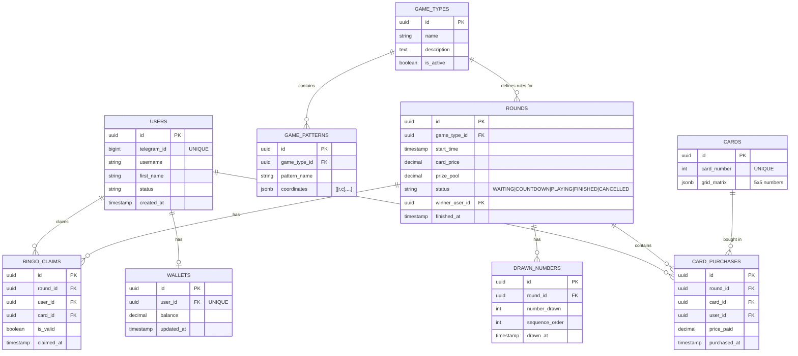

# Project Documentation & System Design: Telegram Multiplayer Bingo Game

**Project:** Real-Time Multiplayer Telegram Bingo Mini App & Bot  
**Version:** 1.0  
**Status:** Architecture, System Design & Technical Specification  

---

## 📋 Navigation Menu (Table of Contents)

- [1. Executive Summary & Product Overview](#1-executive-summary--product-overview)
- [2. Game Context & Core Game Logic Rules](#2-game-context--core-game-logic-rules)
  - [2.1 Standard 5x5 Bingo Card Rules & Matrix](#21-standard-5x5-bingo-card-rules--matrix)
  - [2.2 Predefined Card System & Round Ownership](#22-predefined-card-system--round-ownership)
  - [2.3 Round Lifecycle & State Machine](#23-round-lifecycle--state-machine)
  - [2.4 Dynamic Game Types & Winning Pattern Engine](#24-dynamic-game-types--winning-pattern-engine)
  - [2.5 Live Number Drawing Engine](#25-live-number-drawing-engine)
  - [2.6 Bingo Claiming & Server-Side Verification Algorithm](#26-bingo-claiming--server-side-verification-algorithm)
- [3. Technical Stack](#3-technical-stack)
- [4. Clean Architecture & Codebase Design](#4-clean-architecture--codebase-design)
  - [4.1 Architectural Layers (Clean / Hexagonal Architecture)](#41-architectural-layers-clean--hexagonal-architecture)
  - [4.2 Backend Directory Structure (Modular Monolith)](#42-backend-directory-structure-modular-monolith)
  - [4.3 Frontend Directory Structure (Telegram Mini App)](#43-frontend-directory-structure-telegram-mini-app)
- [5. System Design & Real-Time Architecture](#5-system-design--real-time-architecture)
  - [5.1 High-Level Component System Architecture](#51-high-level-component-system-architecture)
  - [5.2 Real-Time WebSocket & Pub/Sub Event Loop](#52-real-time-websocket--pubsub-event-loop)
- [6. Entity-Relationship (ER) Diagram & Database Schemas](#6-entity-relationship-er-diagram--database-schemas)
  - [6.1 ER Diagram](#61-entity-relationship-er-diagram)
  - [6.2 Relational Database Schemas (PostgreSQL)](#62-relational-database-schemas-postgresql)
  - [6.3 Real-Time In-Memory Caching (Redis Data Structures)](#63-real-time-in-memory-caching-redis-data-structures)
- [7. Telegram Authentication & Security Mechanism](#7-telegram-authentication--security-mechanism)
  - [7.1 Telegram `initData` Cryptographic HMAC-SHA256 Verification](#71-telegram-initdata-cryptographic-hmac-sha256-verification)
  - [7.2 WebSocket Token Handshake Protocol](#72-websocket-token-handshake-protocol)
- [8. Comprehensive API & Event Specifications](#8-comprehensive-api--event-specifications)
  - [8.1 REST API Endpoints](#81-rest-api-endpoints)
  - [8.2 WebSocket Event Protocol Contracts](#82-websocket-event-protocol-contracts)
- [9. Concurrency, Distributed Locking & Anti-Cheat Strategy](#9-concurrency-distributed-locking--anti-cheat-strategy)
  - [9.1 Atomic Card Reservation Protocol](#91-atomic-card-reservation-protocol)
  - [9.2 Winner Race Condition & Dispute Resolution](#92-winner-race-condition--dispute-resolution)
  - [9.3 Security & Server Authoritativeness](#93-security--server-authoritativeness)
- [10. Deployment & Infrastructure Scalability](#10-deployment--infrastructure-scalability)

---

## 1. Executive Summary & Product Overview

The **Telegram Multiplayer Bingo Platform** is a real-time, server-authoritative multiplayer game delivered directly inside Telegram via a **Telegram Mini App** (React/TypeScript) and supported by a **Telegram Bot** (Python).

Players enter the bot, open the Mini App, view upcoming rounds, purchase or reserve Bingo cards, and join a live, real-time multiplayer room. As numbers are drawn live by the backend engine, matching cells are highlighted. When a player completes a valid pattern, they press **BINGO**, initiating an instantaneous, server-authoritative validation algorithm that allocates winnings and declares the round victor.

---

## 2. Game Context & Core Game Logic Rules

### 2.1 Standard 5x5 Bingo Card Rules & Matrix
The game uses standard 75-ball 5x5 Bingo cards. Each column corresponds to a specific number range:

| Column Header | Number Range | Cell Coordinates (Row, Column) |
|---|---|---|
| **B** | 1 – 15 | `(0,0)` to `(4,0)` |
| **I** | 16 – 30 | `(0,1)` to `(4,1)` |
| **N** | 31 – 45 | `(0,2)` to `(4,2)` *(excluding center)* |
| **G** | 46 – 60 | `(0,3)` to `(4,3)` |
| **O** | 61 – 75 | `(0,4)` to `(4,4)` |

* **FREE Space:** The center cell at row index `2`, column index `2` (`[2,2]`) is a permanent **FREE space (⭐)**, which is always pre-marked for every card.

#### Matrix Representation Example:
```text
  B     I     N     G     O
 ───   ───   ───   ───   ───
  9    28    44    51    67    (Row 0)
 13    26    34    46    73    (Row 1)
 12    16    ⭐    50    70    (Row 2 - Center FREE)
 10    21    32    52    71    (Row 3)
 11    30    33    47    66    (Row 4)
```

---

### 2.2 Predefined Card System & Round Ownership
1. **Card Repository:** The system pre-generates a repository of thousands of unique 5x5 cards (e.g., Card `#1` through Card `#5000`), each assigned a unique integer `card_number` and standard grid layout.
2. **Per-Round Atomicity:** Cards can be reused across different rounds. However, **within the same round, a card number can be owned by exactly one player**.
   - *Round 100:* Card `#68` -> Owned by Player A.
   - *Round 101:* Card `#68` is available again for selection by any player.
3. **Card Availability:** Card ownership and reservation state strictly belong to the `Round`, not permanently to the card entity.

---

### 2.3 Round Lifecycle & State Machine

Every game takes place inside a **Round**. A round moves through six strict states:

```text
               ┌───────────────────────┐
               │        WAITING        │  (Players browsing & buying cards)
               └───────────┬───────────┘
                           │ Countdown threshold reached / Start time
                           ▼
               ┌───────────────────────┐
               │       COUNTDOWN       │  (e.g., 30-sec final call before live draw)
               └───────────┬───────────┘
                           │ Countdown expires
                           ▼
               ┌───────────────────────┐
               │        PLAYING        │  (Live number draw engine active)
               └───────────┬───────────┘
                           │ Player submits BINGO claim
                           ▼
               ┌───────────────────────┐
               │     CLAIM_PENDING     │  (Server validates claim atomically)
               └───────┬───────┴───────┘
          Valid Claim  │       │  Invalid Claim (Resume draw)
                       ▼       └──────────────┐
               ┌───────────────┐              │
               │   FINISHED    │◄─────────────┘
               └───────────────┘
                       ▲
                       │ Min players not met / Admin stop
               ┌───────┴───────┐
               │   CANCELLED   │  (Refunds issued)
               └───────────────┘
```

#### Round Attributes:
* `id` (UUID): Unique round identifier.
* `start_time` (Timestamp): Scheduled start time.
* `card_price` (Decimal): Cost per card.
* `prize_pool` (Decimal): Total win payout.
* `game_type_id` (UUID): References the winning rules/pattern set.
* `status` (`WAITING`, `COUNTDOWN`, `PLAYING`, `CLAIM_PENDING`, `FINISHED`, `CANCELLED`).

---

### 2.4 Dynamic Game Types & Winning Pattern Engine

#### Game Type & Pattern Sets:
Each round is linked to a **Game Type**. A Game Type defines a collection of mathematical winning coordinate patterns (e.g., 20-pattern set vs 40-pattern set).

#### Mathematical Coordinate Pattern Representation:
Patterns are stored **not as images**, but as 2D coordinate lists `[(row, col)]`:
```json
// Example 1: Horizontal Top Row Pattern
[ [0,0], [0,1], [0,2], [0,3], [0,4] ]

// Example 2: Diagonal Pattern (Top-Left to Bottom-Right)
[ [0,0], [1,1], [2,2], [3,3], [4,4] ]

// Example 3: Four Corners Pattern
[ [0,0], [0,4], [4,0], [4,4] ]
```

#### Selection & Rotation:
Game Types can be selected via three modes (configurable):
1. Admin Manual Selection.
2. Scheduled Automatic Rotation (e.g., standard line bingo -> pattern bingo -> blackout).
3. Pseudo-Random Selection per round creation.

---

### 2.5 Live Number Drawing Engine

1. When a round enters `PLAYING`, the backend number drawing engine initializes an array of integers `[1..75]` and performs a cryptographically secure shuffle.
2. The server draws numbers one by one at a fixed interval (e.g., every 3 to 5 seconds).
3. Drawn numbers are appended to the round's `drawn_numbers` list in Redis and PostgreSQL.
4. Each drawn number is instantly broadcast to all connected WebSocket clients in the format:
   - Format: `{ letter: "N", number: 34, drawn_at: "2026-09-19T15:30:00Z" }`.
5. No number can ever be drawn twice in the same round.

---

### 2.6 Bingo Claiming & Server-Side Verification Algorithm

#### Client Action:
When a player sees that their marked numbers satisfy a pattern, they press the **BINGO** button.

> [!IMPORTANT]
> The frontend **NEVER** determines the winner. Pressing BINGO sends a claim request to the backend. The backend is 100% authoritative.

#### Verification Flowchart:

```text
 [ Player Clicks BINGO ]
           │
           ▼
 1. Check User Ownership ──( No )──► [ Reject: Card Not Owned ]
           │ (Yes)
           ▼
 2. Check Round Status   ──( Not PLAYING )──► [ Reject: Round Inactive ]
           │ (Active)
           ▼
 3. Fetch Drawn Numbers Set & Card Numbers Matrix
           │
           ▼
 4. Calculate Marked Coordinates Matrix (Grid Intersections + [2,2] FREE)
           │
           ▼
 5. Fetch Active Game Type's Winning Coordinate Patterns
           │
           ▼
 6. Does Marked Coordinates Set Contain ALL Coordinates of ANY Single Pattern?
      ├── YES ──► [ WINNER! Update Round to FINISHED, Credit Wallet, Broadcast Victory ]
      └── NO  ──► [ INVALID! Resume Round Draw, Log False Claim Penalty ]
```

#### Detailed Verification Pseudocode:
```python
def validate_bingo_claim(user_id: UUID, round_id: UUID, card_id: UUID) -> bool:
    # 1. Verify card ownership inside round
    purchase = db.query(CardPurchase).filter_by(round_id=round_id, card_id=card_id, user_id=user_id).first()
    if not purchase:
        return False
        
    # 2. Verify round is in PLAYING state
    round_obj = db.query(Round).get(round_id)
    if round_obj.status != RoundStatus.PLAYING:
        return False
        
    # 3. Get drawn numbers set up to current timestamp
    drawn_numbers = set(redis.lrange(f"round:{round_id}:drawn", 0, -1))
    
    # 4. Get card numbers (5x5 matrix)
    card_matrix = get_card_numbers(card_id) # 5x5 list
    
    # 5. Determine marked coordinates
    marked_coords = set()
    marked_coords.add((2, 2)) # FREE space is always marked
    
    for row in range(5):
        for col in range(5):
            if card_matrix[row][col] in drawn_numbers:
                marked_coords.add((row, col))
                
    # 6. Check against Game Type patterns
    patterns = get_game_type_patterns(round_obj.game_type_id)
    for pattern in patterns:
        pattern_coords = set(pattern.coordinates) # set of (row, col) tuples
        if pattern_coords.issubset(marked_coords):
            return True # VALID BINGO
            
    return False # INVALID BINGO
```

---

## 3. Technical Stack

| Layer | Technology | Details / Rationale |
|---|---|---|
| **Backend Language** | **Python 3.11+** | Async engine, fast development, rich ecosystem |
| **Backend Framework** | **FastAPI** | Async REST APIs, native WebSocket support, Pydantic data validation |
| **Database** | **PostgreSQL 15+** | Relational source of truth for users, rounds, transactions, cards |
| **ORM / Migration** | **SQLAlchemy 2.0 (Async) + Alembic** | High-performance async database mapping and schema versioning |
| **Real-Time & Cache** | **Redis 7.0+** | Pub/Sub event distribution, in-memory live round state & distributed locks |
| **Frontend Framework**| **React 18 / TypeScript / Vite** | Fast SPA optimized for Telegram Mini App environment |
| **Styling** | **Vanilla CSS / CSS Modules** | Custom UI theme, dark mode, high-performance responsive animations |
| **Telegram Integration** | **Python-telegram-bot / Telegram WebApp SDK** | Telegram Bot API for entry/notifications, `@telegram-apps/sdk` for Mini App UI |

---

## 4. Clean Architecture & Codebase Design

The application is designed following **Clean Architecture (Hexagonal Architecture)** inside a **Modular Monolith** structure. This guarantees strict separation of concerns, testability, and easy maintainability.

### 4.1 Architectural Layers (Clean / Hexagonal Architecture)

```text
┌────────────────────────────────────────────────────────────────────────┐
│                        PRESENTATION LAYER                              │
│       FastAPI Controllers, WebSockets Gateways, Telegram Bot Handlers  │
├────────────────────────────────────────────────────────────────────────┤
│                        APPLICATION LAYER                               │
│       Use Cases, Game Loop Orchestrators, DTOs, Event Publishers       │
├────────────────────────────────────────────────────────────────────────┤
│                           DOMAIN LAYER                                 │
│   Entities (User, Round, Card, Pattern), Value Objects, Domain Logic   │
├────────────────────────────────────────────────────────────────────────┤
│                       INFRASTRUCTURE LAYER                             │
│   PostgreSQL Repositories, Redis Adapter, Telegram API Client, Locks   │
└────────────────────────────────────────────────────────────────────────┘
```

1. **Domain Layer:** Core business models (`Round`, `Card`, `BingoPattern`, `User`, `Wallet`). Contains zero external framework dependencies.
2. **Application Layer:** Orchestrates game flows (`CreateRoundUseCase`, `PurchaseCardUseCase`, `ValidateBingoClaimUseCase`, `DrawNumberUseCase`).
3. **Presentation Layer:** FastAPI HTTP REST endpoints, WebSocket endpoint managers, and Telegram bot command handlers (`/start`, `/play`).
4. **Infrastructure Layer:** Database access (SQLAlchemy), Redis Pub/Sub, Redis distributed locking (`Redlock`), Telegram API client.

---

### 4.2 Backend Directory Structure (Modular Monolith)

```text
tele-bot/
└── backend/
    ├── app/
    │   ├── core/
    │   │   ├── config.py             # Environment & app configurations
    │   │   ├── database.py           # Async SQLAlchemy session setup
    │   │   ├── redis.py              # Async Redis client connection
    │   │   └── security.py           # Telegram initData HMAC validation & JWT
    │   │
    │   ├── domain/                   # Domain Core (Entities & Logic)
    │   │   ├── models/
    │   │   │   ├── user.py
    │   │   │   ├── wallet.py
    │   │   │   ├── round.py
    │   │   │   ├── card.py
    │   │   │   └── pattern.py
    │   │   └── services/
    │   │       ├── bingo_validator.py # Pure mathematical pattern validator
    │   │       └── number_drawer.py   # Shuffler & draw sequence generator
    │   │
    │   ├── application/              # Use Cases & Application Services
    │   │   ├── auth_usecase.py
    │   │   ├── card_usecase.py
    │   │   ├── game_loop_usecase.py  # Async loop managing live draw timer
    │   │   ├── round_usecase.py
    │   │   └── wallet_usecase.py
    │   │
    │   ├── infrastructure/           # Database & External Services
    │   │   ├── db/
    │   │   │   ├── models.py         # SQLAlchemy ORM definitions
    │   │   │   └── repositories/     # Async repository pattern impls
    │   │   ├── redis/
    │   │   │   ├── lock_manager.py   # Distributed locks for card buy & claim
    │   │   │   └── pubsub.py         # WS Broadcast channels
    │   │   └── telegram/
    │   │       └── bot.py            # Telegram Bot setup & command handlers
    │   │
    │   └── presentation/             # API & WebSocket Gateways
    │       ├── api/
    │       │   ├── v1/
    │       │   │   ├── auth.py
    │       │   │   ├── users.py
    │       │   │   ├── wallet.py
    │       │   │   ├── rounds.py
    │       │   │   ├── cards.py
    │       │   │   └── admin.py
    │       │   └── router.py
    │       └── websockets/
    │           ├── connection_manager.py # Manages active WS connections per round
    │           └── game_ws.py            # WebSocket event dispatcher
    │
    ├── alembic/                      # Migration scripts
    ├── main.py                       # FastAPI ASGI entrypoint
    └── requirements.txt
```

---

### 4.3 Frontend Directory Structure (Telegram Mini App)

```text
tele-bot/
└── frontend/
    ├── src/
    │   ├── assets/                   # Sound effects, icons, SVGs
    │   ├── components/               # UI components
    │   │   ├── common/               # Buttons, Modals, Loaders
    │   │   ├── game/                 # Bingo Card, Master Board, Number Callout
    │   │   └── rounds/               # Round Card, Countdown Timer
    │   ├── context/                  # React Context (AuthContext, GameWSContext)
    │   ├── features/
    │   │   ├── bingo/                # Live game view & claim handler
    │   │   ├── card_picker/          # Grid view for card selection & search
    │   │   ├── lobby/                # Upcoming rounds list
    │   │   └── wallet/               # Balance & deposit view
    │   ├── hooks/                    # Custom hooks (useWebSocket, useBingoState)
    │   ├── services/                 # Axios HTTP API client & WS client
    │   ├── types/                    # TypeScript Interfaces (Round, Card, Event)
    │   ├── utils/                    # Telegram SDK helpers, coordinate mappers
    │   ├── App.tsx                   # Main route switcher
    │   └── main.tsx                  # Vite React entrypoint
    ├── index.html
    └── package.json
```

---

## 5. System Design & Real-Time Architecture

### 5.1 High-Level Component System Architecture

```text
┌─────────────────────────────────────────────────────────────────────────────────┐
│                             TELEGRAM CLIENT LAYER                               │
│  ┌──────────────────────────┐                      ┌──────────────────────────┐ │
│  │   Telegram Bot Client    │                      │  Telegram Mini App (UI)  │ │
│  │  (Command /start, /help) │                      │   (React / TypeScript)   │ │
│  └─────────────┬────────────┘                      └────────────┬─────────────┘ │
└────────────────│────────────────────────────────────────────────│───────────────┘
                 │ HTTPS                                          │ HTTPS + WebSockets
                 ▼                                                ▼
┌─────────────────────────────────────────────────────────────────────────────────┐
│                             FASTAPI BACKEND SYSTEM                              │
│  ┌──────────────────────────┐                      ┌──────────────────────────┐ │
│  │   REST API Controllers   │                      │    WebSocket Manager     │ │
│  │  (Auth, Rounds, Cards)   │                      │  (Live Events Broadcast) │ │
│  └─────────────┬────────────┘                      └────────────┬─────────────┘ │
│                │                                                │               │
│                ▼                                                ▼               │
│  ┌───────────────────────────────────────────────────────────────────────────┐  │
│  │                            GAME ENGINE CORE                               │  │
│  │  ┌────────────────────┐ ┌────────────────────┐ ┌────────────────────────┐ │  │
│  │  │ Number Draw Engine │ │ Validation Engine  │ │ Round Lifecycle Worker │ │  │
│  │  └────────────────────┘ └────────────────────┘ └────────────────────────┘ │  │
│  └─────────────────────────────────────┬─────────────────────────────────────┘  │
└────────────────────────────────────────│────────────────────────────────────────┘
                                         │
                         ┌───────────────┴───────────────┐
                         ▼                               ▼
      ┌────────────────────────────────────┐  ┌───────────────────────────────────┐
      │         REDIS (IN-MEMORY)          │  │       POSTGRESQL (DATABASE)       │
      │ ├── Round WS Pub/Sub Channels      │  │ ├── Permanent User & Wallet Store │
      │ ├── Live Drawn Numbers Array       │  │ ├── Card Repository (5000 Cards)  │
      │ ├── Card Reservation Lock (Redlock)│  │ ├── Round History & Transactions  │
      │ └── Active WS Connection State     │  │ └── Game Types & Winning Patterns │
      └────────────────────────────────────┘  └───────────────────────────────────┘
```

---

### 5.2 Real-Time WebSocket & Pub/Sub Event Loop

When a round starts, all connected players subscribe to a Redis Pub/Sub channel dedicated to that round (`round:{round_id}:events`).

```text
 [ Async Number Draw Loop ]
           │
           │ 1. Draws Number (e.g. N-34)
           ├──────────────────────────────────────────┐
           │                                          │
           ▼                                          ▼
 2. Push to Redis List                     3. Publish to Redis Pub/Sub
    "round:100:drawn"                         "round:100:events"
           │                                          │
           │                                          ▼
           │                         4. WebSocket Manager Receives Event
           │                                          │
           │                                          ▼
           │                         5. Broadcasts JSON payload over WS
           │                            to ALL connected round clients
           │                                          │
           ▼                                          ▼
 [ Saved to Postgres Async ]               [ Mini App UI Highlights N-34 ]
```

---

## 6. Entity-Relationship (ER) Diagram & Database Schemas

### 6.1 Entity-Relationship ER Diagram



---

### 6.2 Relational Database Schemas (PostgreSQL)

#### 1. `users` Table
```sql
CREATE TABLE users (
    id UUID PRIMARY KEY DEFAULT gen_random_uuid(),
    telegram_id BIGINT UNIQUE NOT NULL,
    username VARCHAR(64),
    first_name VARCHAR(64),
    status VARCHAR(20) DEFAULT 'ACTIVE',
    created_at TIMESTAMP WITH TIME ZONE DEFAULT NOW(),
    updated_at TIMESTAMP WITH TIME ZONE DEFAULT NOW()
);
```

#### 2. `wallets` Table
```sql
CREATE TABLE wallets (
    id UUID PRIMARY KEY DEFAULT gen_random_uuid(),
    user_id UUID UNIQUE NOT NULL REFERENCES users(id) ON DELETE CASCADE,
    balance NUMERIC(12, 2) NOT NULL DEFAULT 0.00 CHECK (balance >= 0),
    updated_at TIMESTAMP WITH TIME ZONE DEFAULT NOW()
);
```

#### 3. `cards` Table (5000 Predefined Cards)
```sql
CREATE TABLE cards (
    id UUID PRIMARY KEY DEFAULT gen_random_uuid(),
    card_number INT UNIQUE NOT NULL,
    grid_matrix JSONB NOT NULL, -- 5x5 array of integers
    created_at TIMESTAMP WITH TIME ZONE DEFAULT NOW()
);
-- Index for quick lookup by card_number
CREATE INDEX idx_cards_card_number ON cards(card_number);
```

#### 4. `game_types` & `game_patterns` Tables
```sql
CREATE TABLE game_types (
    id UUID PRIMARY KEY DEFAULT gen_random_uuid(),
    name VARCHAR(64) NOT NULL,
    description TEXT,
    is_active BOOLEAN DEFAULT TRUE,
    created_at TIMESTAMP WITH TIME ZONE DEFAULT NOW()
);

CREATE TABLE game_patterns (
    id UUID PRIMARY KEY DEFAULT gen_random_uuid(),
    game_type_id UUID NOT NULL REFERENCES game_types(id) ON DELETE CASCADE,
    pattern_name VARCHAR(64) NOT NULL,
    coordinates JSONB NOT NULL, -- List of [row, col] pairs e.g. [[0,0], [0,1], [0,2], [0,3], [0,4]]
    created_at TIMESTAMP WITH TIME ZONE DEFAULT NOW()
);
```

#### 5. `rounds` & `card_purchases` Tables
```sql
CREATE TABLE rounds (
    id UUID PRIMARY KEY DEFAULT gen_random_uuid(),
    game_type_id UUID NOT NULL REFERENCES game_types(id),
    start_time TIMESTAMP WITH TIME ZONE NOT NULL,
    card_price NUMERIC(10, 2) NOT NULL,
    prize_pool NUMERIC(12, 2) NOT NULL,
    status VARCHAR(20) NOT NULL DEFAULT 'WAITING',
    winner_user_id UUID REFERENCES users(id),
    finished_at TIMESTAMP WITH TIME ZONE,
    created_at TIMESTAMP WITH TIME ZONE DEFAULT NOW()
);

CREATE TABLE card_purchases (
    id UUID PRIMARY KEY DEFAULT gen_random_uuid(),
    round_id UUID NOT NULL REFERENCES rounds(id) ON DELETE CASCADE,
    card_id UUID NOT NULL REFERENCES cards(id),
    user_id UUID NOT NULL REFERENCES users(id),
    price_paid NUMERIC(10, 2) NOT NULL,
    purchased_at TIMESTAMP WITH TIME ZONE DEFAULT NOW(),
    CONSTRAINT uq_round_card UNIQUE (round_id, card_id) -- Prevents duplicate card purchase in same round!
);
```

---

### 6.3 Real-Time In-Memory Caching (Redis Data Structures)

For ultra-fast real-time lookups and state management during active live rounds, Redis is utilized:

| Key Format | Data Structure | Purpose |
|---|---|---|
| `round:{round_id}:state` | **Hash** | Stores live status, total cards sold, active prize pool |
| `round:{round_id}:drawn` | **List** | Ordered sequence of drawn numbers `[34, 12, 67, ...]` |
| `round:{round_id}:drawn_set` | **Set** | Set of drawn numbers for O(1) membership check during claim validation |
| `round:{round_id}:cards_taken` | **Set** | Set of `card_id`s already purchased in this round |
| `lock:round:{round_id}:card:{card_id}` | **String (Key)** | Distributed Redlock key for atomic card selection |
| `lock:round:{round_id}:claim` | **String (Key)** | Distributed Lock ensuring single winner evaluation at a time |

---

## 7. Telegram Authentication & Security Mechanism

### 7.1 Telegram `initData` Cryptographic HMAC-SHA256 Verification

When a user opens the Telegram Mini App, Telegram injects a cryptographically signed query string into `window.Telegram.WebApp.initData`.

```text
┌────────────────────────┐                   ┌────────────────────────┐
│ Telegram Mini App (UI) │                   │  FastAPI Backend API   │
└───────────┬────────────┘                   └───────────┬────────────┘
            │                                            │
            │ 1. Sends initData in Authorization Header  │
            │    Authorization: Bearer <initData>       │
            ├───────────────────────────────────────────►│
            │                                            │
            │                                            │ 2. Parse & sort initData fields
            │                                            │ 3. HMAC-SHA256 with BOT_TOKEN
            │                                            │ 4. Validate computed signature == hash
            │                                            │ 5. Verify auth_date <= 24h
            │                                            │ 6. Upsert User & Wallet in PostgreSQL
            │                                            │ 7. Return JWT Access Token
            │                                            │
            │ 8. Returns JWT Access Token & User Info    │
            │◄───────────────────────────────────────────┤
```

#### Validation Algorithm (Backend Implementation):
```python
import hmac
import hashlib
from urllib.parse import parse_qsl

def verify_telegram_init_data(init_data_raw: str, bot_token: str) -> dict:
    parsed_data = dict(parse_qsl(init_data_raw, keep_blank_values=True))
    received_hash = parsed_data.pop("hash", None)
    if not received_hash:
        raise ValueError("Missing hash parameter")
        
    # Sort remaining parameters lexicographically
    data_check_string = "\n".join(f"{k}={v}" for k, v in sorted(parsed_data.items()))
    
    # Calculate HMAC secret key using static text "WebAppData"
    secret_key = hmac.new(b"WebAppData", bot_token.encode(), hashlib.sha256).digest()
    
    # Calculate expected hash
    calculated_hash = hmac.new(secret_key, data_check_string.encode(), hashlib.sha256).hexdigest()
    
    # Constant-time comparison to prevent timing attacks
    if not hmac.compare_digest(calculated_hash, received_hash):
        raise ValueError("Invalid cryptographic signature")
        
    return parsed_data # Contains user object with telegram_id
```

---

### 7.2 WebSocket Token Handshake Protocol
Since standard browser WebSockets do not easily allow custom HTTP headers on handshake, WebSockets authenticate using the JWT generated during Telegram auth:
* **WS Connection URL:** `wss://api.bingogame.com/ws/rounds/{round_id}?token=<JWT_ACCESS_TOKEN>`
* The backend WebSocket manager validates the JWT signature before upgrading the HTTP connection to a WebSocket.

---

## 8. Comprehensive API & Event Specifications

### 8.1 REST API Endpoints

Base Path: `/api/v1`

#### 1. Authentication
* `POST /api/v1/auth/telegram`
  * **Request:** `{ "init_data": "query_id=...&user=...&hash=..." }`
  * **Response:** `{ "access_token": "<JWT>", "token_type": "bearer", "user": { "id": "...", "telegram_id": 12345678 } }`

#### 2. User & Wallet
* `GET /api/v1/users/me`
  * **Response:** Returns current user profile and registration timestamp.
* `GET /api/v1/wallet/balance`
  * **Response:** `{ "balance": 150.00, "currency": "ETB" }`

#### 3. Rounds & Card Selection
* `GET /api/v1/rounds/upcoming`
  * **Response:** Returns array of upcoming rounds with `WAITING` or `COUNTDOWN` status.
* `GET /api/v1/rounds/{round_id}/cards`
  * **Query Params:** `page=1&limit=50&search=68`
  * **Response:** Returns available & locked card numbers for the round.
  ```json
  {
    "round_id": "r100-uuid",
    "total_cards": 5000,
    "cards": [
      { "card_number": 1, "status": "LOCKED" },
      { "card_number": 2, "status": "AVAILABLE" },
      { "card_number": 68, "status": "AVAILABLE" }
    ]
  }
  ```
* `POST /api/v1/rounds/{round_id}/buy-card`
  * **Request:** `{ "card_number": 68 }`
  * **Response (200 OK):**
  ```json
  {
    "purchase_id": "p123-uuid",
    "card_number": 68,
    "grid_matrix": [
      [9, 28, 44, 51, 67],
      [13, 26, 34, 46, 73],
      [12, 16, 0, 50, 70],
      [10, 21, 32, 52, 71],
      [11, 30, 33, 47, 66]
    ],
    "new_balance": 140.00
  }
  ```

#### 4. Bingo Claims
* `POST /api/v1/rounds/{round_id}/claim-bingo`
  * **Request:** `{ "card_id": "card-uuid" }`
  * **Response (200 OK):** `{ "result": "VALID_BINGO", "prize_won": 500.00 }`
  * **Response (400 Bad Request):** `{ "result": "INVALID_BINGO", "message": "Card does not satisfy active winning pattern" }`

---

### 8.2 WebSocket Event Protocol Contracts

Endpoint: `/ws/rounds/{round_id}?token=<JWT>`

#### Server -> Client Broadcast Events:

##### 1. `NUMBER_DRAWN`
Broadcast every time a new Bingo number is drawn.
```json
{
  "event": "NUMBER_DRAWN",
  "data": {
    "letter": "N",
    "number": 34,
    "drawn_sequence": 12,
    "drawn_at": "2026-09-19T15:31:05Z"
  }
}
```

##### 2. `CARD_RESERVED`
Broadcast when another player buys a card in the room.
```json
{
  "event": "CARD_RESERVED",
  "data": {
    "card_number": 68,
    "status": "LOCKED"
  }
}
```

##### 3. `ROUND_STATUS_CHANGED`
Broadcast when round transitions state (e.g. `COUNTDOWN` -> `PLAYING`).
```json
{
  "event": "ROUND_STATUS_CHANGED",
  "data": {
    "status": "PLAYING",
    "started_at": "2026-09-19T15:30:00Z"
  }
}
```

##### 4. `BINGO_WINNER`
Broadcast when a valid Bingo claim ends the game.
```json
{
  "event": "BINGO_WINNER",
  "data": {
    "winner_user_id": "user-uuid",
    "winner_username": "ananya_winner",
    "winning_card_number": 68,
    "prize_amount": 500.00,
    "pattern_completed": "TOP_ROW_HORIZONTAL"
  }
}
```

---

## 9. Concurrency, Distributed Locking & Anti-Cheat Strategy

### 9.1 Atomic Card Reservation Protocol

To prevent two players from purchasing the exact same card in a round simultaneously:
1. When a user requests to buy Card `#68` in Round `100`, the server attempts to acquire a **Redis Redlock**: `lock:round:100:card:68` with a 3-second TTL.
2. If lock acquisition fails, the server immediately returns HTTP 409 Conflict ("Card is currently being purchased by another player").
3. If lock is acquired:
   - Check if Card `#68` exists in Redis Set `round:100:cards_taken`.
   - If present, release lock & return HTTP 400 ("Card already sold").
   - Execute PostgreSQL transaction: deduct wallet balance, insert `card_purchases` record (enforced by `UNIQUE(round_id, card_id)` database constraint).
   - Add Card `#68` to Redis Set `round:100:cards_taken`.
   - Release Redlock.
   - Broadcast `CARD_RESERVED` WS event.

---

### 9.2 Winner Race Condition & Dispute Resolution

#### Challenge:
In a live game with thousands of players, two players might press **BINGO** within milliseconds of each other.

#### Solution (Atomic Lock Execution):
1. Upon receiving a Bingo claim, the server acquires a Redis lock for the round: `lock:round:{round_id}:claim`.
2. Check if `round.status` is still `PLAYING`. If status is already `FINISHED`, instantly reject the second claim with `"Round already won by another player"`.
3. Perform mathematical pattern verification for the claim.
4. If valid:
   - Atomically set `round.status = FINISHED`.
   - Mark `winner_user_id` in PostgreSQL.
   - Credit prize to user's wallet within the database transaction.
   - Release lock.
   - Broadcast `BINGO_WINNER` event.
5. If invalid:
   - Release lock.
   - Reject claim for that player; draw engine continues unimpeded.

---

### 9.3 Security & Server Authoritativeness

1. **Zero Client Trust:** The client UI only renders what the server dictates. Marked numbers on the client card are purely visual. The server maintains its own copy of card numbers and drawn numbers.
2. **Rate Limiting:** WS claim events are rate-limited to maximum 1 claim request per 2 seconds per player to eliminate claim spamming.
3. **Cryptographic Integrity:** Telegram `initData` is validated on every auth session, preventing spoofed `telegram_id` requests.

---

## 10. Deployment & Infrastructure Scalability

```text
┌─────────────────────────────────────────────────────────────────────────────────┐
│                              CLOUD INFRASTRUCTURE                               │
│                                                                                 │
│   ┌────────────────────┐      ┌─────────────────────┐    ┌──────────────────┐   │
│   │   Nginx / Caddy    │─────►│  FastAPI (Uvicorn)  │───►│ Redis 7.0 Cluster│   │
│   │ (Reverse Proxy/SSL)│      │  (4 Async Workers)  │    │ (Pub/Sub & Cache)│   │
│   └────────────────────┘      └──────────┬──────────┘    └──────────────────┘   │
│                                          │                                      │
│                                          ▼                                      │
│                               ┌─────────────────────┐                           │
│                               │ PostgreSQL 15 (RDS) │                           │
│                               └─────────────────────┘                           │
└─────────────────────────────────────────────────────────────────────────────────┘
```

1. **ASGI Web Server:** FastAPI running under **Uvicorn** with multiple async worker processes managed by Gunicorn.
2. **Horizontal Scaling:** State is maintained in Redis (not local memory), allowing multiple FastAPI backend instances to run behind a load balancer with sticky sessions for WebSockets.
3. **Database Indexing:** Indexing on `(round_id, card_id)` and `(telegram_id)` ensures sub-millisecond query performance under high concurrency.
