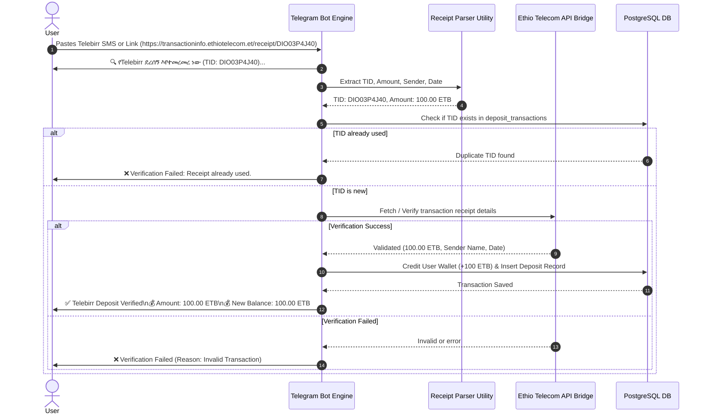

# 📋 Architectural & Design Specification: A Bingo (GoodBingo Style)

**Project:** Real-Time Telegram Bingo Mini App (A Bingo / GoodBingo Edition)  
**Document:** `update.md`  
**Reference Assets:** `images/` (22 Reference Screenshots Analyzed)  
**Version:** 3.0  

---

## 1. 🎯 Overview & Scope of Changes

This document outlines the visual redesign, Telegram Bot mechanics update, and isolated PostgreSQL database setup for **A Bingo** based on the reference screenshots in the `images/` directory.

Key Differences from Previous Application:
1. **New Visual UI Design System**: Transition from dark obsidian to the **GoodBingo Light Slate & White design**, featuring rounded square grid cells, vertical 5x15 Master Board, 2-card slot selection dock, and gold-framed winner cards with multi-winner pagination carousel.
2. **Enhanced Telegram Bot Engine**: Direct SMS & receipt link parsing (`https://transactioninfo.ethiotelecom.et/receipt/...`), automated verification, multi-step conversational withdrawal flow, `/history` reporting, and room selection keyboard (`PLAY | 10 ብር`, `SuperBingo | 50 ብር`).
3. **Isolated PostgreSQL Deployment**: Dedicated database schema (`a_bingo_db`), connection pooling via `asyncpg`, anti-fraud Telebirr receipt tracking, and independent multi-environment setup.

---

## 2. 🎨 UI/UX Design System Specification

### 🎨 Color Tokens & Aesthetic Foundations
```css
:root {
  /* Backgrounds */
  --bg-app: #EBF1F7;                  /* Light slate app background */
  --bg-card-surface: #FFFFFF;         /* Pure white container cards */
  --bg-grid-cell: #F1F5F9;             /* Light grey cell background */
  --bg-dark-banner: #1E293B;          /* Dark navy banner containers */

  /* Primary & Accent Colors */
  --brand-gold: #F59E0B;              /* Golden yellow badges & borders */
  --brand-blue: #2563EB;              /* Primary action blue (BINGO! button) */
  --brand-green: #10B981;             /* Matched pattern green & balance */
  --brand-red: #EF4444;               /* Warning text & callout badge */

  /* Column Colors (B-I-N-G-O) */
  --col-b: #3B82F6;                   /* Bright Blue */
  --col-i: #EF4444;                   /* Vibrant Red */
  --col-n: #F59E0B;                   /* Amber Gold */
  --col-g: #10B981;                   /* Emerald Green */
  --col-o: #8B5CF6;                   /* Purple */

  /* Typography */
  --font-heading: 'Outfit', sans-serif;
  --font-body: 'Inter', sans-serif;
}
```

---

### 📱 Screen Specifications

#### 1. Card Picker & Room Selection Screen (`CardPickerView`)
```text
┌────────────────────────────────────────────────────────────────────────┐
│  ROOM VIP 💰 💰  │   SOLD 682   │   TIME 28s   │  BALANCE 100.00 ETB  │
├────────────────────────────────────────────────────────────────────────┤
│ STAKE: 50 ETB   │  የጨዋታ አይነት: ሙሉ ዝግ  │  TIME: ዘወትር አርብ-እሁድ 10 ሰዓት│
├────────────────────────────────────────────────────────────────────────┤
│ ┌───┐ ┌───┐ ┌───┐ ┌───┐ ┌───┐ ┌───┐ ┌───┐ ┌───┐                        │
│ │ 1 │ │ 2 │ │ 3 │ │ 4 │ │ 5 │ │ 6 │ │ 7 │ │ 8 │ (8 Cards per row)      │
│ └───┘ └───┘ └───┘ └───┘ └───┘ └───┘ └───┘ └───┘                        │
│ ... (Scrollable grid 1 to 5,000)                                       │
├────────────────────────────────────────────────────────────────────────┤
│  ┌──────────────────────────────┐    ┌──────────────────────────────┐  │
│  │     + SLOT 1 EMPTY           │    │     + SLOT 2 EMPTY           │  │
│  └──────────────────────────────┘    └──────────────────────────────┘  │
└────────────────────────────────────────────────────────────────────────┘
```
- **Selected Card**: Bright blue outline ring (e.g. Card `#88`).
- **Sold Cards**: Faded out with reduced opacity (e.g. Card `#9`, `#49`).
- **Slot Selection Dock**: Dashed border cards allowing players to select and manage up to 2 active cards per round.

#### 2. Live Playing View & 5x15 Master Board (`BingoGameView`)
```text
┌────────────────────────────────────────────────────────────────────────┐
│ DERASH 3448 ETB   │   BALLS 10/75   │   PLAYERS 431   │   ( G-50 )     │
├────────┬───────────────────────────────────────────────────────────────┤
│ B I N G O│  [ I30 ] [ I27 ] [ N44 ] (Recent Callouts)                    │
│ 1 16 31 46 61│ ┌───┬───┬───┬───┬───┐                                      │
│ 2 17 32 47 62│ │ B │ I │ N │ G │ O │ (Colorful Columns)                   │
│ 3 18 33 48 63│ ├───┼───┼───┼───┼───┤                                      │
│ 4 19 34 49 64│ │ 7 │ 20│ 44│ 56│ 61│                                      │
│ 5 20 35 50 65│ ├───┼───┼───┼───┼───┤                                      │
│ 6 21 36 51 66│ │ 15│ 26│ 36│ 55│ 62│                                      │
│ 7 22 37 52 67│ ├───┼───┼───┼───┼───┤                                      │
│ 8 23 38 53 68│ │ 5 │ 17│ ★ │ 54│ 69│ (Center Free Star ★)                │
│ ...          │ └───┴───┴───┴───┴───┘                                      │
│ 15 30 45 60 75│ ┌───────────────────────────┐                              │
│              │ │       BINGO!        #39   │ (Action Button)            │
│              │ └───────────────────────────┘                              │
└──────────────┴────────────────────────────────────────────────────────┘
```
- **Master Board Column**: Vertical 5x15 grid on left. Uncalled = White, Called = Yellow, Latest Call = Green.
- **Floating Callout Ball**: Top right circle (e.g., green/gold `G-50` ball).
- **Spectator Mode**: Displays animated hourglass with text `GAME IN PROGRESS - PLEASE WAIT FOR THE NEXT BUYING ROUND TO JOIN.` when a user joins mid-round without cards.

#### 3. Winner Announcement Modal (`WinnerModal`)
- White pop-up modal with a rounded gold border.
- Header showing winner count (`1 አሸናፊ` or `2 አሸናፊዎች`) and winner payout (`1724 ETB`).
- Total Prize Pool banner (`TOTAL PRIZE POOL 3448 ETB`).
- Winning card display with matched cells in yellow and winning pattern line in emerald green.
- Carousel pagination buttons (`<` `>`) and progress dots (`• o`) for multi-winner rounds.
- Bottom fill bar: `NEXT ROUND: 10S`.

---

## 3. 🤖 Telegram Bot Operational Specifications

### 🤖 Bot Command Architecture
| Command | Action / Response Description |
| :--- | :--- |
| `/start` | Welcome message with main menu keyboard & `/play` Mini App launch button |
| `/play` | Inline room selection: `🎮 PLAY \| 10 ብር`, `SuperBingo \| 50 ብር`, `GoodBingo Bonus` |
| `/balance` | Displays available balance: `💰 ቀሪ ሂሳብ (Available): 100.00 ETB` |
| `/deposit` | Deposit method picker: `[ CBE BIRR ]` `[ TELE BIRR ]` + instructions |
| `/withdraw` | Step-by-step withdrawal prompt (Min 100 ETB, Telebirr phone & account name input) |
| `/history` | Transaction log listing past deposits and withdrawals with status (`PENDING` / `SUCCESS`) |
| `/instructions`| Game rules with ASCII BINGO pattern diagrams |

---

### 💳 Telebirr Automated Receipt Verification Flow



---

## 4. 🗄️ PostgreSQL Database Schema Adjustments

To support the **GoodBingo** flow, the PostgreSQL schema includes:
1. **`users` Table**: Telegram ID, username, phone number, balance, status.
2. **`wallets` Table**: High-precision decimal balance tracking with transaction locks.
3. **`cards` Table**: 5,000 unique 5x5 bingo card grid matrices.
4. **`rounds` Table**: Active game status (`WAITING`, `COUNTDOWN`, `PLAYING`, `FINISHED`), card price, prize pool, winner user ID, and game type.
5. **`card_purchases` Table**: Round-to-card reservations (up to 2 cards per slot).
6. **`deposit_transactions` Table**: Stores Telebirr transaction IDs (`reference_code`), amounts, payment method, sender name, and status (`PENDING`, `COMPLETED`, `REJECTED`) for idempotent receipt verification.
7. **`withdrawal_transactions` Table**: Withdrawal requests storing phone number, account name, payment method (`TELEBIRR`, `CBE_BIRR`), amount, and status (`PENDING`, `COMPLETED`).

---

## 5. 🚀 Deployment Roadmap

1. **Database Migration**: Run automated PostgreSQL migrations & seed 5,000 cards.
2. **Frontend UI Redesign**: Implement Light Slate / GoodBingo design system components.
3. **Telegram Bot Engine Upgrade**: Enable Telebirr receipt regex parsing & step-by-step withdrawal state machine.
4. **Docker Compose & Server Launch**: Deploy PostgreSQL 16 container, Redis, FastAPI Backend, and Vite Frontend.
